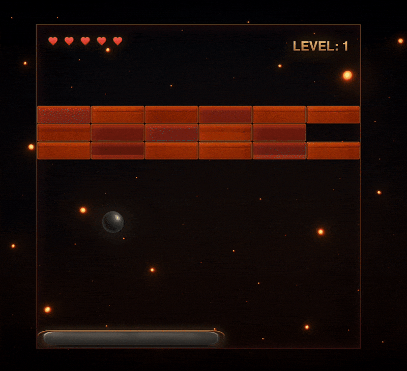

# Bricks Breaker

Classic brick-breaking game built with React and TypeScript.
Players use the paddle to bounce the ball and break all bricks to progress through levels.



[Live Demo](https://bricks-breaker-fawn.vercel.app/)

## Features

- Multiple levels with increasing difficulty and different brick patterns.
- Responsive controls using arrow keys or A/D keys for paddle movement.
- Pause functionality with game state persistence.
- Lives system with visual heart indicators.
- Smooth canvas-based rendering with texture support for game elements.
- Progressive level completion with level transition screens.
- Game state persistence using browser localStorage.
- UI with animated overlays and smooth transitions.

## Installation

Project requires Node.js 18+ installed.

Install dependencies:

```bash
npm install
```

Start the development server:

```bash
npm run dev
```

Build a production bundle (optional):

```bash
npm run build
```

Preview production build:

```bash
npm run preview
```

## Tooling

- **Vite** for development server and bundling.
- **React 19** for UI components.
- **TypeScript** for type safety.
- **ESLint** with the default Vite React config.
- **Prettier** for code formatting.
